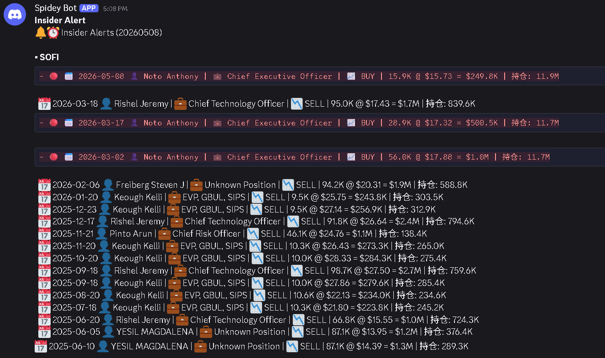

# SEC4-Insider-cronjob

A simple Java bot that runs on GitHub Actions to check for large insider transactions (>500k USD) for specified US stock tickers.

## Features

- Checks SEC Form 4 filings for the previous day
- Filters for purchase (P) and sale (S) transactions over $500,000
- Sends push notifications via Discord webhook when alerts are found
- Runs daily at 9 AM UTC or manually via workflow dispatch

## Setup

1. Fork this repository.
2. Create a Discord webhook:
   - Open your Discord server and go to `Server Settings` → `Integrations` → `Webhooks`.
   - Click `New Webhook` and select a channel where you want alerts to appear.
   - Copy the webhook URL.
3. Add the webhook URL to a new secret named `DISCORD_WEBHOOK_URL`
   - Open your fork on GitHub and go to `Settings` → `Secrets and variables` → `Actions`.
4. Setup tickers, threshold and lookback days in secrets  
   - Add a new secret named `TICKERS`.
   - Add a new secret named `THRESHOLD`.
   - Add a new secret named `LOOKBACK`.
5. 钉钉通知（可选）：在 Settings → Secrets and variables → Actions 中设置
   - `DING_WEBHOOK_URL`：钉钉机器人 Webhook 地址
   - `DING_WEBHOOK_SIGN`：钉钉机器人加签密钥
6. (Optional) Create a Personal Access Token (PAT) to enable updating cronjob defaults via workflow:
   - Go to `Settings` → `Developer settings` → `Personal access tokens` → `Fine-grained tokens`.
   - Click `Generate new token`, select your fork repository, and grant **Read and write** permission for **Secrets**.
   - Copy the generated token and add it as a new secret named `PAT` in your repository's `Settings` → `Secrets and variables` → `Actions`.
7. Run the workflow manually or wait for the daily schedule:
   - Go to the `Actions` tab, choose `Daily Insider Check`, then `Run workflow`.
   - Enter tickers, threshold, and lookback values as needed.

## Usage

- **Manual run**: Go to Actions tab, select "Daily Insider Check", click "Run workflow", enter your desired tickers, threshold, and lookback days. Defaults are provided.
- **Scheduled**: Runs daily automatically using default values in `./.github/workflows/daily-check.yml`. You need to customise tickers, threshold and lookback to your preferences.
- **Update default cronjob config**: Go to Actions tab, select "Daily Insider Check", click "Run workflow", fill in your desired tickers, threshold, and/or lookback values, then set `Update cronjob default config?` to `true`. This will save the provided values as repository secrets (`TICKERS`, `THRESHOLD`, `LOOKBACK`), so that future scheduled runs automatically pick them up. You only need to fill in the fields you want to change — blank fields are ignored and won't overwrite existing secrets. **Requires the `PAT` secret to be set up first** (see Setup step 6).
- **Configuration**: 
  - **GitHub secret**: Set `DISCORD_WEBHOOK_URL` in Settings → Secrets and variables → Actions
  - **钉钉通知（可选）**：在 Settings → Secrets and variables → Actions 中设置 `DING_WEBHOOK_URL`：钉钉机器人 Webhook 地址 `DING_WEBHOOK_SIGN`：钉钉机器人加签密钥
  - **Ticker format**: `BRKB` or `BRK-B` are supported; `BRK.B` is not supported. Ticker input is case-insensitive.

- Push notifications include ticker, owner, position, action, security, shares, price, and amount on separate lines.

## Requirements

- Maven
- GitHub Actions

## Notes

- Only checks non-derivative transactions (P/S codes)
- Excludes awards (A) and exercises (M) to avoid RSU-related transactions
- Data from SEC EDGAR, subject to their terms
